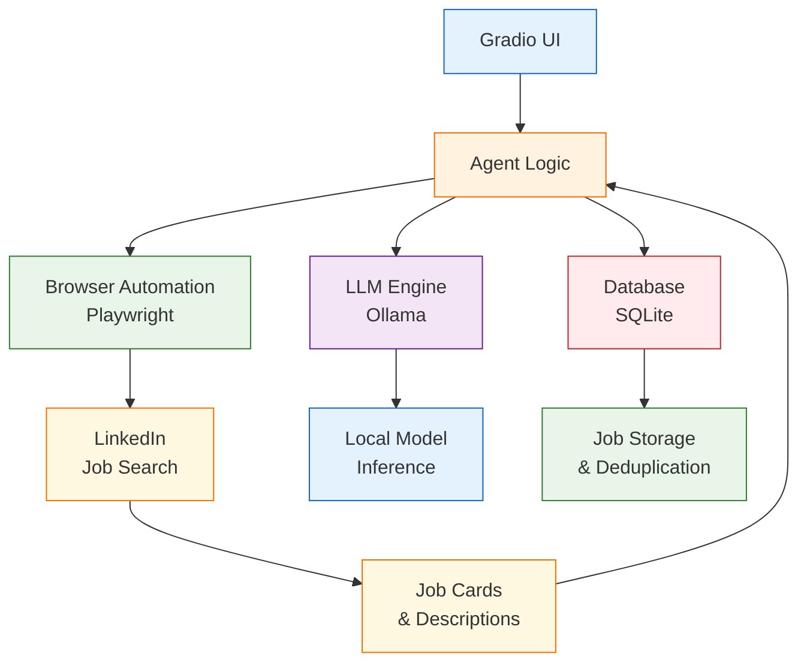
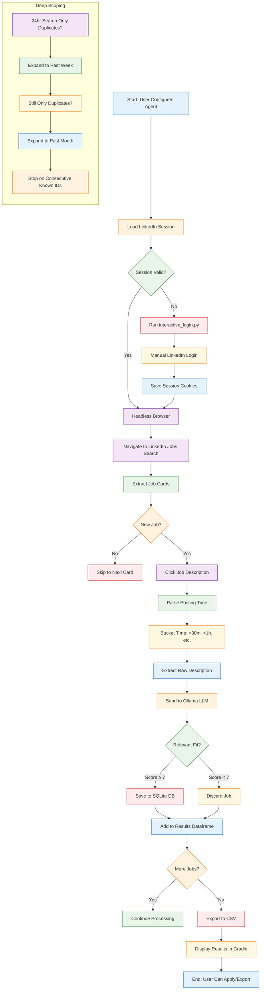

# Job Search Agent - FCC Project

A local, private job search agent that scrapes LinkedIn for relevant positions using Ollama LLMs for intelligent filtering.

## Features
- **Local-first**: All processing happens on your machine
- **Session persistence**: Secure LinkedIn login session storage
- **Intelligent filtering**: Uses local LLMs to evaluate job relevance
- **Time-bucket analysis**: Categorizes jobs by posting time (<30m, <1h, etc.)
- **Duplicate prevention**: SQLite database prevents re-processing same jobs
- **Real-time UI**: Gradio interface with live results
- **CSV export**: Automatically exports findings to timestamped CSV files
- **Stealth scraping**: Built-in throttling to avoid detection

## Architecture


## Setup Instructions

### 1. Prerequisites
- Ubuntu Linux (or any OS with Docker/Podman support)
- [Ollama](https://ollama.ai/) installed and running
- At least one LLM model pulled (e.g., `ollama pull llama3`)
- Python 3.8+

### 2. Installation
```bash
# Clone or create the directory
mkdir job_search-fcc && cd job_search-fcc

# Install Python dependencies
pip install -r requirements.txt

# Install Playwright browsers
playwright install
```

### 3. Initial Setup (One-time)
```bash
# Run the interactive login script to set up your LinkedIn session
python interactive_login.py

# Follow the prompts to log in to LinkedIn manually
# Close the browser when you're on your LinkedIn feed
```

### 4. Usage
```bash
# Start the agent
python agent.py

# The Gradio interface will open at http://127.0.0.1:7860
```

### 5. Using the Interface
1. **Select your Ollama model** from the dropdown (click refresh to update)
2. **Enter your target role** (e.g., "Edge AI Engineer")
3. **Specify location preference** (e.g., "Remote", "New York")
4. **Adjust throttle** if needed (higher = safer but slower)
5. **Click "Initialize Agent"** to start scraping
6. **Watch results** appear in the dataframe in real-time
7. **Click URLs** to open jobs directly in your browser
8. **Check the exports folder** for CSV files of your results

## How It Works


## LLM Evaluation Schema
The agent instructs the LLM to output JSON matching this schema:
```json
{
  "is_relevant_fit": boolean,
  "requires_edge_hardware": boolean,
  "hardware_mentioned": ["list"],
  "requires_robotics_stack": boolean,
  "protocols_mentioned": ["list"],
  "years_experience_required": integer,
  "remote_policy": "string",
  "match_score_1_to_10": integer (1-10),
  "red_flags": ["list"]
}
```

## Customization
- Adjust the relevance threshold (currently 7/10) in `agent.py`
- Modify time buckets in the `time_bucket()` function
- Change LinkedIn search parameters in the `scrape_linkedin_jobs()` function
- Add new evaluation criteria to the LLM prompt and database schema

## Privacy & Security
- **Zero data leaves your machine** unless you explicitly share CSV exports
- LinkedIn session stored only locally in Chrome user data format
- No external APIs called except Ollama (running locally)
- Playwright operates in headless mode after initial setup
- Respects robots.txt via reasonable throttling

## Troubleshooting
- **"Model not found"**: Make sure Ollama is running (`ollama serve`) and you've pulled a model
- **Login issues**: Re-run `interactive_login.py` to refresh your session
- **Slow performance**: Increase throttle value in the UI
- **No jobs found**: Check your LinkedIn credentials and search terms
- **CAPTCHA blocks**: Increase throttle or solve manually during interactive login

## License
MIT License - Feel free to modify and extend for your job search needs.

---
**Built with ❤️ for private, efficient job hunting**
