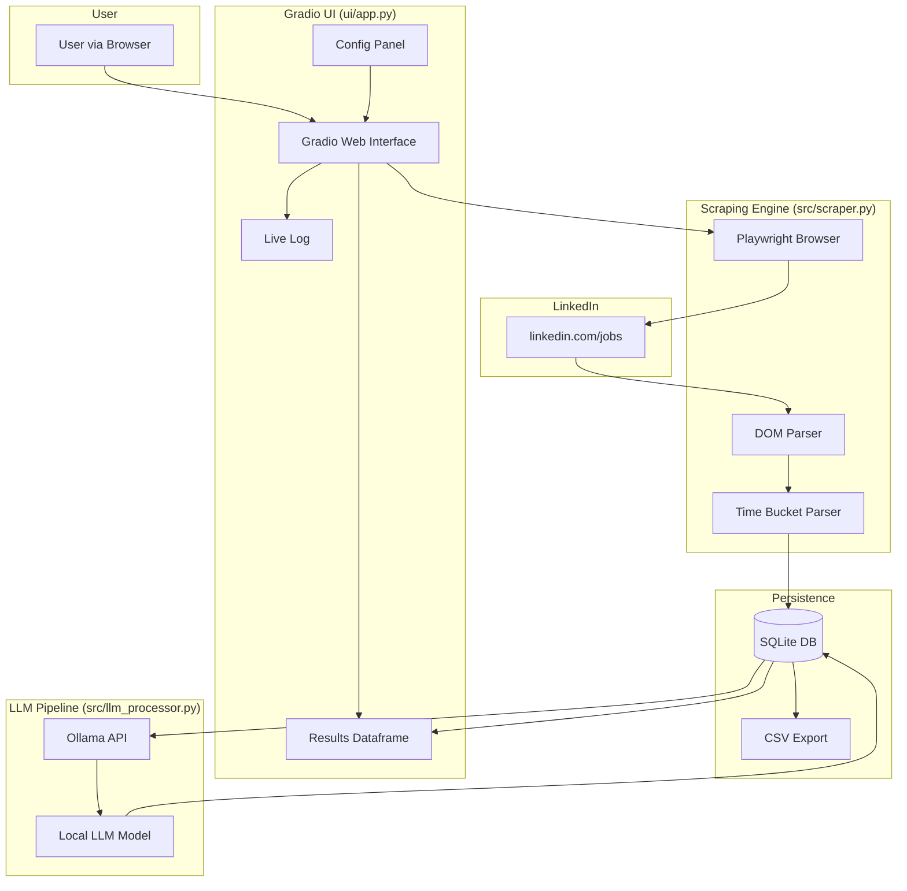
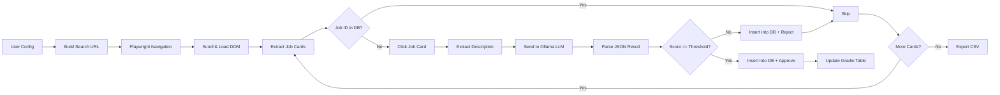
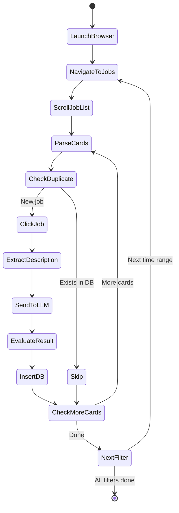
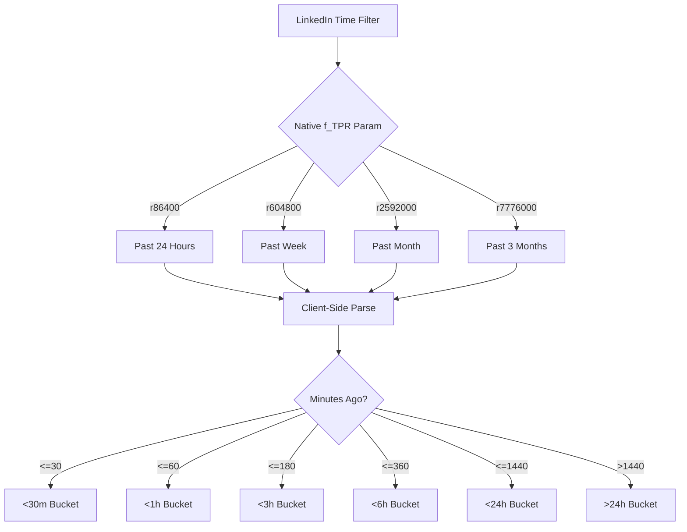
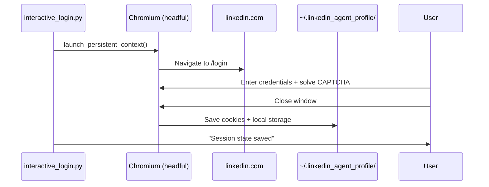
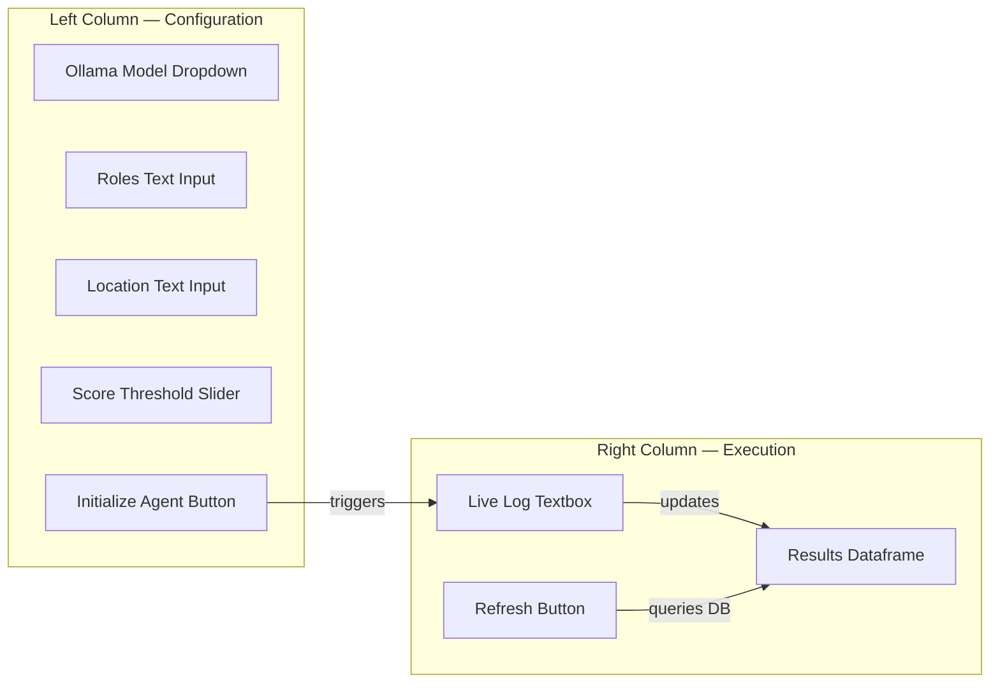
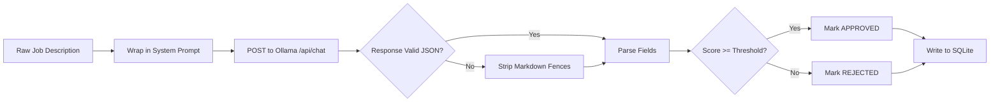

<div align="center">

# LinkedIn Job Search Agent

**v1.0.0** — *AI-powered LinkedIn job scraper with local LLM evaluation*

[](https://python.org)
[](https://playwright.dev)
[](https://gradio.app)
[](https://ollama.com)
[](LICENSE)

---

**Created by [Kumar Satyam](mailto:kumarsatyam3135@gmail.com)**  
A fully local, AI-powered job search agent that scrapes LinkedIn, evaluates job descriptions with a local LLM (Ollama), and presents results through a Gradio web UI.

**Zero cloud dependencies — everything runs on your machine.**

</div>

---

## Table of Contents

- [Overview](#overview)
- [Features](#features)
- [Architecture](#architecture)
  - [High-Level System Diagram](#high-level-system-diagram)
  - [Data Flow Pipeline](#data-flow-pipeline)
  - [Scraping State Machine](#scraping-state-machine)
  - [Time Bucket Engine](#time-bucket-engine)
- [Tech Stack](#tech-stack)
- [Project Structure](#project-structure)
- [Quick Start](#quick-start)
  - [Prerequisites](#prerequisites)
  - [Setup](#step-1--setup)
  - [Authentication](#step-2--authenticate-with-linkedin)
  - [Launch](#step-3--launch-the-ui)
- [How It Works](#how-it-works)
  - [Phase 1: Authentication](#phase-1-authentication)
  - [Phase 2: Gradio UI](#phase-2-gradio-ui)
  - [Phase 3: Scraping Engine](#phase-3-scraping-engine)
  - [Phase 4: LLM Evaluation](#phase-4-llm-evaluation)
  - [Phase 5: Data Export](#phase-5-data-export)
- [Configuration](#configuration)
- [Troubleshooting](#troubleshooting)
- [License](#license)

---

## Overview

LinkedIn Job Search Agent automates the tedious process of searching and filtering job postings. It:

1. **Scrapes** LinkedIn job listings using Playwright (headless Chromium)
2. **Evaluates** each job description against your profile using a local LLM via Ollama
3. **Scores & filters** jobs based on relevance to Edge AI, Robotics, and Embedded ML
4. **Exports** approved matches to CSV

All data stays local — no API keys, no cloud services, no third-party data sharing.

---

## Features

- **Fully local** — Everything runs on your machine; no data leaves your network
- **Multi-sweep scraping** — Searches 4 time windows (24h, week, month, 3 months)
- **Intelligent deduplication** — SQLite-backed; never processes the same job twice
- **LLM-powered evaluation** — Uses any local Ollama model to score job fit (Edge AI / Robotics focus)
- **Structured JSON output** — Evaluates hardware requirements, protocols, remote policy, red flags
- **Live Gradio UI** — Real-time log streaming + results dataframe with refresh
- **CSV export** — Timestamped exports of approved jobs
- **Anti-detection** — Session persistence, human-like scrolling, duplicate limits

---

## Architecture

### High-Level System Diagram



### Data Flow Pipeline



### Scraping State Machine



### Time Bucket Engine



---

## Tech Stack

| Component | Technology | Purpose |
|-----------|------------|---------|
| **Browser Automation** | Playwright (Python) | DOM scraping, session persistence |
| **Frontend UI** | Gradio 5.x | Dual-panel web interface, real-time streaming |
| **Database** | SQLite 3 | Local deduplication, job storage |
| **Local LLM** | Ollama | JSON-structured job evaluation |
| **Data Processing** | Pandas | Dataframe display, CSV export |
| **Language** | Python 3.12+ | Core application logic |
| **OS** | Linux (Ubuntu 24.04 LTS) | Host environment |

---

## Project Structure

```
jobsearch/
├── config/
│   ├── __init__.py
│   └── settings.py              # Configurable constants (thresholds, paths, buckets)
├── scripts/
│   └── interactive_login.py     # One-time manual LinkedIn authentication
├── src/
│   ├── __init__.py
│   ├── database.py              # SQLite schema & CRUD operations
│   ├── exporter.py              # Timestamped CSV export
│   ├── llm_processor.py         # Ollama API wrapper + JSON parsing
│   ├── scraper.py               # Playwright scraping engine + time filters
│   └── time_bucket.py           # Time string parsing & bucket assignment
├── ui/
│   └── app.py                   # Gradio web interface (entry point)
├── data/                        # Auto-created: SQLite DB + CSV exports
├── venv/                        # Auto-created: Python virtual environment
├── .gitignore
├── requirements.txt             # Python dependencies
├── setup.sh                     # One-command setup script
└── README.md                    # This file
```

---

## Quick Start

### Prerequisites

- **Python 3.12+** (pre-installed on Ubuntu 24.04)
- **Ollama** running locally on `http://localhost:11434`

```bash
curl -fsSL https://ollama.com/install.sh | sh
ollama pull llama3.2          # or any model you prefer
ollama serve                  # start the Ollama server
```

### Step 1 — Setup

```bash
cd ~/jobsearch
bash setup.sh
```

This creates a virtual environment, installs all dependencies, and downloads the Playwright Chromium browser.

### Step 2 — Authenticate with LinkedIn

```bash
source venv/bin/activate
python scripts/interactive_login.py
```

A browser window opens. Log in to LinkedIn, solve any CAPTCHA, navigate to `/jobs/`, then close the window. Your session is saved to `~/.linkedin_agent_profile` for headless reuse.

**Important:** Re-run this if LinkedIn forces a logout or session expires.

### Step 3 — Launch the UI

```bash
source venv/bin/activate
python ui/app.py
```

Open [http://localhost:7860](http://localhost:7860) in your browser.

---

## How It Works

### Phase 1: Authentication

The interactive login script uses Playwright's **persistent context** feature to save cookies, local storage, and session tokens to a dedicated profile directory.



### Phase 2: Gradio UI

The UI has a **two-column layout**:

| Left Panel (Configuration) | Right Panel (Execution & Results) |
|----------------------------|-----------------------------------|
| Ollama model dropdown (auto-detected) | Live terminal-style log |
| Target roles (comma-separated) | Dynamic results dataframe |
| Location input | Refresh table button |
| Match score threshold slider (1–10) | |
| Initialize Agent button | |



### Phase 3: Scraping Engine

The scraper uses LinkedIn's native URL parameters for broad time filtering, then applies **client-side micro-buckets** for granular sorting.

#### Native Filter Progression

| Sweep | URL Parameter | Scope |
|-------|--------------|-------|
| 1 | `f_TPR=r86400` | Past 24 hours |
| 2 | `f_TPR=r604800` | Past week |
| 3 | `f_TPR=r2592000` | Past month |
| 4 | `f_TPR=r7776000` | Past 3 months |

#### Anti-Detection Strategy

- Sorted by **"Most Recent"** (`sortBy=DD`)
- Stops deep pagination when **20 consecutive duplicates** are detected
- Per-bucket limit prevents over-scrolling
- Session reuse avoids login pages
- Randomized human-like scrolling pauses

### Phase 4: LLM Evaluation

Each new job description is sent to your local Ollama model with a **system prompt** that enforces strict JSON output.

#### Evaluation Schema

```json
{
  "is_relevant_fit": true,
  "requires_edge_hardware": true,
  "hardware_mentioned": ["Jetson", "Hailo-8"],
  "requires_robotics_stack": true,
  "protocols_mentioned": ["MAVLink", "ROS 2"],
  "years_experience_required": 3,
  "remote_policy": "Hybrid",
  "match_score_1_to_10": 8,
  "red_flags": []
}
```

#### LLM Pipeline



#### Supported Models

Any Ollama model that follows JSON instructions works well:

| Model | Size | Speed | Accuracy |
|-------|------|-------|----------|
| `llama3.2` | 3B | Fast | Good |
| `llama3.1:8b` | 8B | Medium | Better |
| `mistral` | 7B | Medium | Good |
| `qwen2.5:7b` | 7B | Fast | Very Good |
| `qwen2.5-coder:14b` | 14B | Slow | Excellent |

### Phase 5: Data Export

#### SQLite Schema

```sql
CREATE TABLE jobs (
    job_id TEXT PRIMARY KEY,
    title TEXT,
    company TEXT,
    location TEXT,
    posted_minutes_ago INTEGER,
    time_bucket TEXT,
    linkedin_url TEXT,
    description TEXT,
    is_relevant_fit INTEGER,
    requires_edge_hardware INTEGER,
    hardware_mentioned TEXT,
    requires_robotics_stack INTEGER,
    protocols_mentioned TEXT,
    years_experience_required INTEGER,
    remote_policy TEXT,
    match_score INTEGER,
    red_flags TEXT,
    llm_raw_json TEXT,
    created_at TEXT DEFAULT (datetime('now'))
);
```

#### CSV Export

After each sweep, approved jobs are exported to `data/approved_jobs_YYYYMMDD_HHMMSS.csv` with all evaluation fields included.

---

## Configuration

All settings live in `config/settings.py` or can be overridden via environment variables:

| Variable | Default | Description |
|----------|---------|-------------|
| `OLLAMA_BASE_URL` | `http://localhost:11434` | Ollama API endpoint |
| `MATCH_SCORE_THRESHOLD` | `6` | Minimum score (1–10) to approve |
| `SCRAPE_LIMIT_PER_BUCKET` | `50` | Max new jobs processed per time bucket |
| `SCROLL_PAUSE_SEC` | `2.0` | Seconds between scroll actions |
| `MAX_SCROLLS` | `30` | Maximum scroll iterations per sweep |
| `LINKEDIN_PROFILE_DIR` | `~/.linkedin_agent_profile` | Browser session storage |

---

## Troubleshooting

### `ModuleNotFoundError: No module named 'gradio'`

You're not using the virtual environment. Always activate it first:

```bash
source venv/bin/activate
```

### `externally-managed-environment`

Ubuntu 24.04 blocks system-wide pip installs. Use the provided `setup.sh` which creates a venv.

### Playwright Chromium won't launch

Install system dependencies:

```bash
sudo playwright install --with-deps chromium
```

### Session expired / login redirect during scraping

Re-run the interactive login to refresh your session:

```bash
python scripts/interactive_login.py
```

### Ollama model not showing in dropdown

Make sure Ollama is running and has models pulled:

```bash
ollama serve          # start Ollama server
ollama pull llama3.2  # pull a model
```

### No jobs found in results

- Verify your LinkedIn session is valid (re-run interactive login)
- Check that your search keywords match real LinkedIn job postings
- Look at the live log for error messages
- Ensure Playwright Chromium is installed: `playwright install chromium`

---

## License

MIT © 2026 [Kumar Satyam](mailto:kumarsatyam3135@gmail.com)

---

<div align="center">

**Built with** [Playwright](https://playwright.dev) · [Gradio](https://gradio.app) · [Ollama](https://ollama.com) · [SQLite](https://sqlite.org)

</div>
